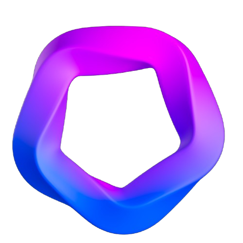
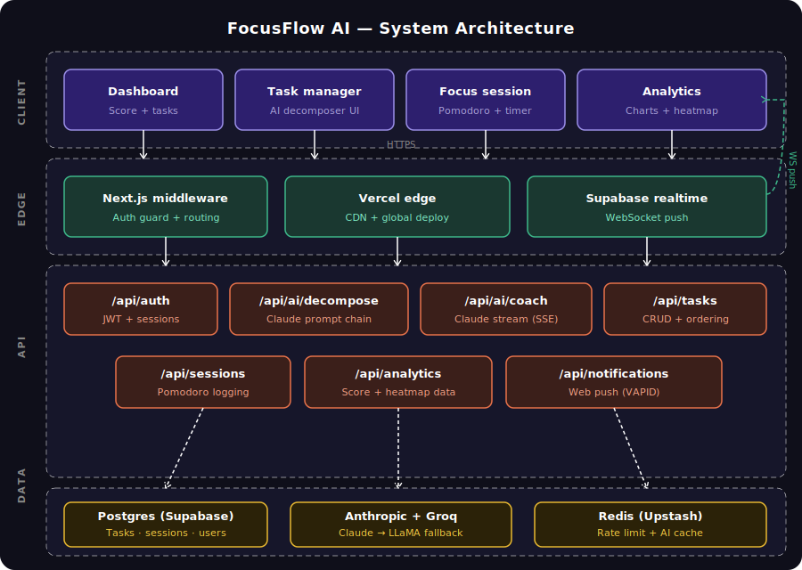
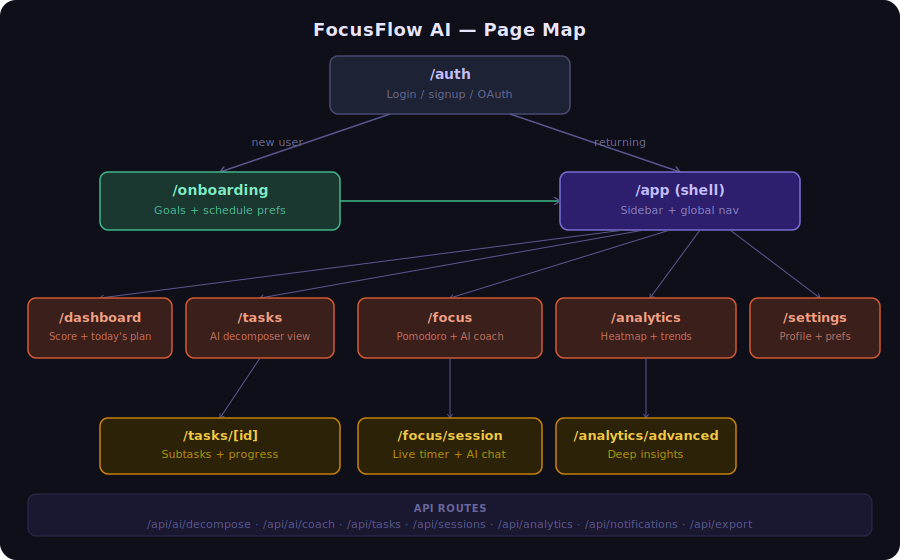
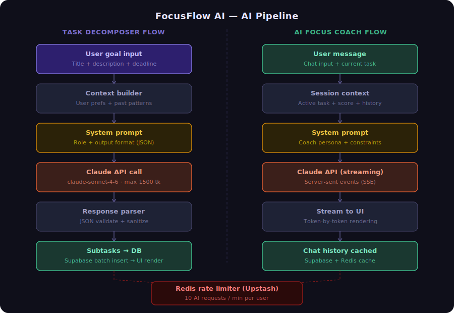
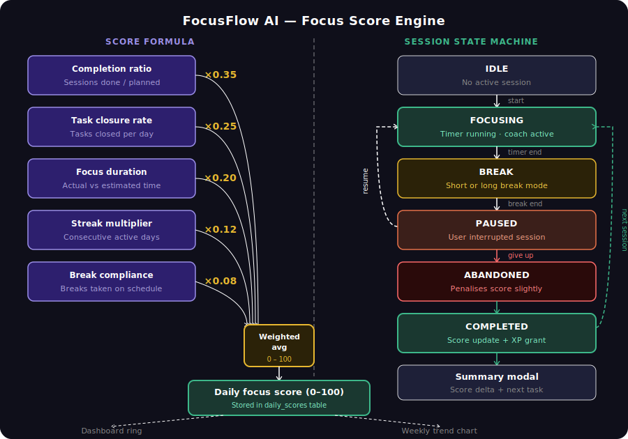

<div align="center">



# FocusFlow AI

**The AI-powered focus operating system for serious builders.**

[](https://focusflow-ai-k5w1.vercel.app)
[](https://nextjs.org)
[](https://typescriptlang.org)
[](https://supabase.com)
[](LICENSE)

Built for **NextGenHacks** — the hackathon for next-gen builders.

</div>

---

## What is FocusFlow AI?

FocusFlow AI is a full-stack productivity application that combines the **Pomodoro technique** with **AI-powered task decomposition**, a **real-time streaming focus coach**, and **deep analytics** — all in a single, beautifully designed interface.

> Stop managing tasks. Start finishing them.

---

## Features

### AI Task Decomposition
Paste any goal and the AI breaks it into focused subtasks — each scoped to a single Pomodoro session. Powered by Anthropic Claude (primary) with Groq LLaMA 3.3 70B as automatic fallback.

### Smart Pomodoro Timer
A fully customizable Pomodoro timer with short breaks, long breaks, and configurable session cycles. Plays sound cues and sends browser push notifications when sessions end.

### Streaming AI Focus Coach
An in-session AI coach that streams responses token by token. Ask it math problems, get unstuck, or say you're distracted — it switches between tutor and coach mode automatically.

### Real-time Focus Score
A proprietary focus scoring algorithm that tracks session consistency, streak days, and daily goal progress. Visualized as a score ring, week chart, and 12-week heatmap.

### Advanced Analytics
12-week heatmap, weekly bar charts, productivity trend lines, session history, and exportable data.

### Keyboard-First UX
Full keyboard navigation with `⌘K` command palette, single-key shortcuts for every page, and a shortcut help overlay (`?`).

---

## Tech Stack

| Layer | Technology |
|---|---|
| Framework | Next.js 14 (App Router) |
| Language | TypeScript 5 |
| Styling | Tailwind CSS + Radix UI |
| Database | Supabase (PostgreSQL) |
| Auth | Supabase Auth (Google, GitHub, Email) |
| AI Primary | Anthropic Claude Sonnet 4.6 |
| AI Fallback | Groq LLaMA 3.3 70B |
| Rate Limiting | Upstash Redis |
| Push Notifications | Web Push API (VAPID) |
| Charts | Recharts |
| Deployment | Vercel |

---

## System Architecture



The app is structured across four layers — **Client**, **Edge**, **API**, and **Services/Data** — with Supabase Realtime pushing live updates via WebSocket.

---

## Page Map



New users go through `/onboarding` to set their schedule and goals. Returning users land in the app shell with sidebar navigation across Dashboard, Tasks, Focus, Analytics, and Settings.

---

## AI Pipeline



Two independent AI flows share a Redis rate limiter:

- **Task decomposer** — single completion call, returns structured JSON subtasks written directly to the database
- **Focus coach** — streaming SSE, token-by-token rendering in the chat UI, history cached in Redis

Both use Anthropic Claude as primary with Groq LLaMA 3.3 70B as silent automatic fallback on quota errors.

---

## Focus Score Engine



The daily focus score (0–100) is a weighted average of five signals:

| Signal | Weight |
|---|---|
| Completion ratio (sessions done / planned) | 35% |
| Task closure rate | 25% |
| Focus duration accuracy | 20% |
| Streak multiplier | 12% |
| Break compliance | 8% |

Sessions flow through a state machine: **IDLE → FOCUSING → BREAK → PAUSED → COMPLETED/ABANDONED**. Completed sessions grant XP and update the score; abandoned sessions apply a small penalty.

---

## Database ERD

```
┌──────────────┐       ┌──────────────────┐       ┌─────────────────┐
│    USERS     │       │      TASKS        │       │    SUBTASKS     │
├──────────────┤       ├──────────────────┤       ├─────────────────┤
│ id (UUID) PK │──┐    │ id (UUID) PK     │──┐    │ id (UUID) PK    │
│ email        │  │    │ user_id FK    ←──┘  │    │ task_id FK   ←──┘
│ full_name    │  └───▶│ title            │  └───▶│ title           │
│ avatar_url   │       │ description      │       │ estimated_mins  │
│ preferences  │       │ status           │       │ completed       │
│ created_at   │       │ priority         │       │ order_index     │
└──────────────┘       │ estimated_mins   │       │ ai_generated    │
       │               │ deadline         │       └─────────────────┘
       │               └──────────────────┘
       │                        │
       ▼                        ▼
┌──────────────────┐   ┌──────────────────┐
│  FOCUS_SESSIONS  │   │  DAILY_SCORES    │
├──────────────────┤   ├──────────────────┤
│ id (UUID) PK     │   │ id (UUID) PK     │
│ user_id FK       │   │ user_id FK       │
│ task_id FK       │   │ date             │
│ status           │   │ focus_score      │
│ started_at       │   │ sessions_planned │
│ ended_at         │   │ sessions_done    │
│ planned_mins     │   │ tasks_completed  │
│ actual_mins      │   │ total_focus_mins │
│ interruptions    │   │ streak_day       │
└──────────────────┘   └──────────────────┘
```

---

## Project Structure

```
focusflow-ai/
├── src/
│   ├── app/                        # Next.js App Router
│   │   ├── auth/
│   │   │   ├── login/page.tsx
│   │   │   ├── signup/page.tsx
│   │   │   └── callback/route.ts   # OAuth callback
│   │   ├── dashboard/
│   │   ├── focus/                  # Pomodoro + AI coach
│   │   ├── tasks/
│   │   │   └── [id]/               # Task detail + decomposition
│   │   ├── analytics/
│   │   │   └── advanced/
│   │   ├── sessions/
│   │   ├── settings/
│   │   ├── onboarding/
│   │   └── api/
│   │       ├── ai/
│   │       │   ├── coach/          # Streaming SSE coach
│   │       │   └── decompose/      # Task decomposition
│   │       ├── tasks/
│   │       ├── sessions/
│   │       ├── analytics/
│   │       ├── notifications/      # Web push
│   │       ├── export/
│   │       └── users/me/
│   │
│   ├── components/
│   │   ├── dashboard/              # Score ring, stats, charts
│   │   ├── focus/                  # Timer, coach chat, history
│   │   ├── tasks/                  # Task list, detail, AI decomposer
│   │   ├── analytics/              # Charts, heatmap
│   │   ├── settings/
│   │   ├── layout/                 # Sidebar, header, theme
│   │   └── ui/                     # Button, command palette, toaster
│   │
│   ├── lib/
│   │   ├── ai/client.ts            # Anthropic + Groq + prompts
│   │   ├── supabase/
│   │   │   ├── client.ts
│   │   │   ├── server.ts
│   │   │   └── schema.sql
│   │   ├── hooks/
│   │   │   ├── use-pomodoro.ts
│   │   │   ├── use-coach-chat.ts
│   │   │   ├── use-active-session.ts
│   │   │   ├── use-tasks.ts
│   │   │   ├── use-analytics.ts
│   │   │   ├── use-notifications.ts
│   │   │   └── use-keyboard-shortcuts.tsx
│   │   └── utils/
│   │       ├── score.ts            # Focus score algorithm
│   │       ├── rate-limit.ts       # Upstash rate limiter
│   │       ├── date.ts
│   │       └── sound.ts
│   │
│   ├── types/index.ts
│   ├── middleware.ts               # Auth + cookie sync
│   └── styles/globals.css
│
├── docs/                           # Architecture diagrams
│   ├── focusflow_system_architecture.png
│   ├── focusflow_page_map.png
│   ├── focusflow_ai_pipeline.png
│   └── focusflow_score_engine.png
├── public/
├── .env.example
└── package.json
```

---

## Getting Started

### Prerequisites

- Node.js 18+
- [Supabase](https://supabase.com) project
- [Anthropic](https://console.anthropic.com) API key
- [Groq](https://console.groq.com) API key
- [Upstash Redis](https://console.upstash.com) database

### 1. Clone

```bash
git clone https://github.com/anshumanbahekar/focusflow-ai.git
cd focusflow-ai
npm install
```

### 2. Environment variables

```bash
cp .env.example .env.local
```

```env
# Supabase
NEXT_PUBLIC_SUPABASE_URL=https://your-project.supabase.co
NEXT_PUBLIC_SUPABASE_ANON_KEY=your_anon_key
SUPABASE_SERVICE_ROLE_KEY=your_service_role_key

# AI — Anthropic primary, Groq auto-fallback
ANTHROPIC_API_KEY=sk-ant-...
GROQ_API_KEY=gsk_...

# Upstash Redis
UPSTASH_REDIS_REST_URL=https://...
UPSTASH_REDIS_REST_TOKEN=...

# Web Push (generate with: npx web-push generate-vapid-keys)
NEXT_PUBLIC_VAPID_PUBLIC_KEY=...
VAPID_PRIVATE_KEY=...
VAPID_SUBJECT=mailto:you@example.com

NEXT_PUBLIC_APP_URL=http://localhost:3000
```

### 3. Database setup

In Supabase → SQL Editor, run the full schema:

```
src/lib/supabase/schema.sql
```

### 4. OAuth setup (optional)

For Google and GitHub login, set the Authorization callback URL in both providers to:

```
https://your-project.supabase.co/auth/v1/callback
```

Enable providers in Supabase → Authentication → Providers.

### 5. Run

```bash
npm run dev
```

---

## Deployment

1. Push to GitHub
2. Import at [vercel.com/new](https://vercel.com/new)
3. Add all env vars (use "Import .env" to paste at once)
4. Set `NEXT_PUBLIC_APP_URL` to your Vercel URL
5. Add Vercel URL to Supabase → Authentication → URL Configuration
6. Deploy — every push to `main` auto-deploys

---

## Keyboard Shortcuts

| Key | Action |
|-----|--------|
| `D` | Dashboard |
| `T` | Tasks |
| `F` | Focus |
| `A` | Analytics |
| `S` | Settings |
| `N` | New task |
| `⌘K` | Command palette |
| `?` | Show all shortcuts |

---

## Environment Variables Reference

| Variable | Required | Description |
|----------|----------|-------------|
| `NEXT_PUBLIC_SUPABASE_URL` | ✅ | Supabase project URL |
| `NEXT_PUBLIC_SUPABASE_ANON_KEY` | ✅ | Supabase anon key |
| `SUPABASE_SERVICE_ROLE_KEY` | ✅ | Supabase service role key |
| `ANTHROPIC_API_KEY` | ⚠️ | Claude API key (Groq used if absent) |
| `GROQ_API_KEY` | ✅ | Groq API key (fallback AI) |
| `UPSTASH_REDIS_REST_URL` | ✅ | Upstash Redis URL |
| `UPSTASH_REDIS_REST_TOKEN` | ✅ | Upstash Redis token |
| `NEXT_PUBLIC_VAPID_PUBLIC_KEY` | ✅ | VAPID public key |
| `VAPID_PRIVATE_KEY` | ✅ | VAPID private key |
| `VAPID_SUBJECT` | ✅ | Contact email (`mailto:...`) |
| `NEXT_PUBLIC_APP_URL` | ✅ | Your app URL |

---

## License

MIT © 2026 [Anshuman Bahekar](https://github.com/anshumanbahekar)

---

<div align="center">

Built with ❤️ for **NextGenHacks**

[Live Demo](https://focusflow-ai-k5w1.vercel.app) · [GitHub](https://github.com/anshumanbahekar/focusflow-ai) · [Report Bug](https://github.com/anshumanbahekar/focusflow-ai/issues)

</div>
